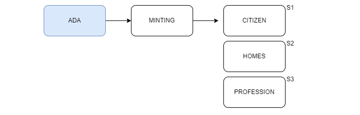

# ➡️ Native Cardenia Token


**P2E under development:** This feature is under development and new changes to the mechanics may appear over time. If you have any further questions, please ask questions on our discord.


Developed for the community, **$BUKZ** (a **native Cardenia token**) is an essential part of the economic ecosystem of Cardenia City. The utility of this token is initially in the form of rewards through staking and our play 2 earn game.

To understand how we want to deliver and work with our token, please read [token-allocation.md](token-allocation.md "mention")

If you have a Citizen (Cardenian CNFT) you will be able to claim <mark style="color:red;">**1k token per citizen**</mark> as a free airdrop, read it into [airdrop.md](airdrop.md "mention")

:white\_check\_mark: View BUKZ Token history at [Cardano Scan](https://cardanoscan.io/token/4c5d6baa4e94b86ccfba57848f3ed157350e27ec4b2a2e165a7cdc1442554b5a)

### Entering Project

### NFTs Ecosystem

### Token and CG Usability

